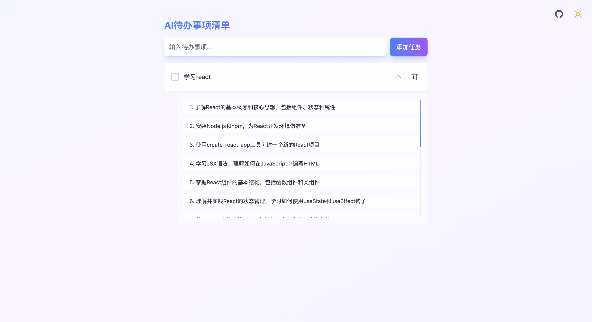
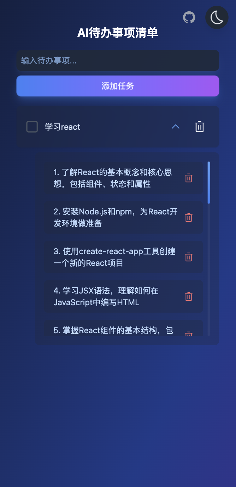

# AI Todo List 智能待办清单

一个基于 Vue 3 + TypeScript 开发的智能待办清单应用，集成 AI 自动分解任务功能。

## ✨ 特性

- 🤖 AI 自动分解任务步骤
- 🌓 明暗主题切换
- 💾 本地数据持久化
- 🎯 任务完成特效
- 📱 响应式设计
- ⚡️ 流畅的动画效果

## 🛠️ 技术栈

- Vue 3
- TypeScript
- OpenAI API
- Vite
- Unocss

## 🚀 快速开始

1. 克隆项目
```bash
git clone https://github.com/your-repo/ai-todo-list.git
cd ai-todo-list
```

2. 安装依赖

```bash
pnpm install
```

3. 配置环境变量

```bash
.env
# 深度求索deepseek API 密钥
VITE_DEEPSEEK_API_KEY=your_api_key
```

4. 运行项目

```bash
pnpm dev
```


